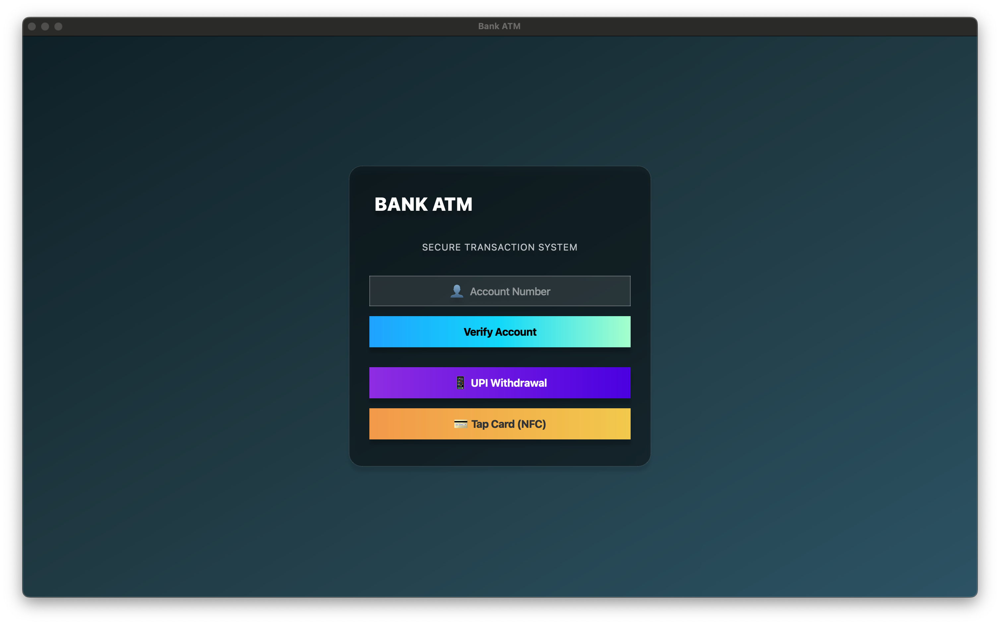
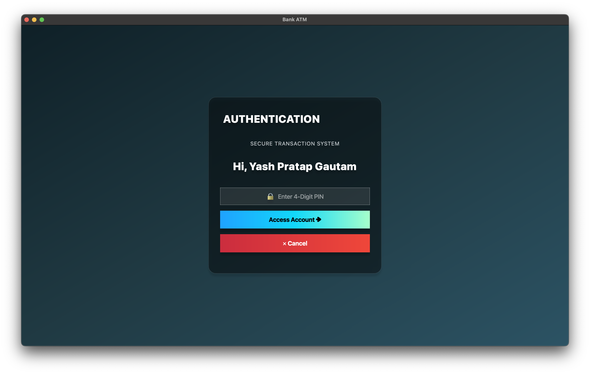
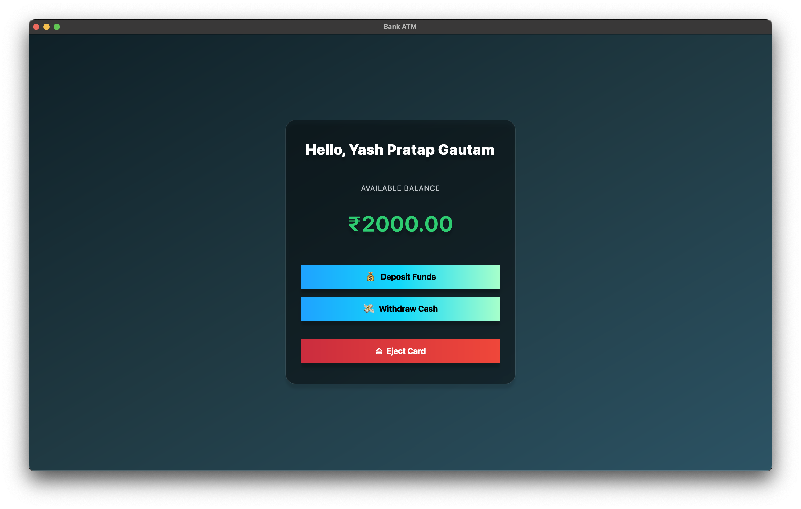
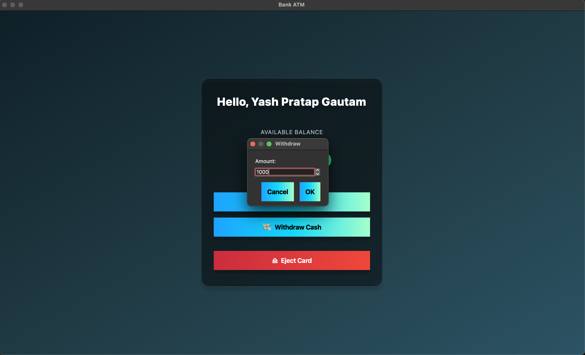
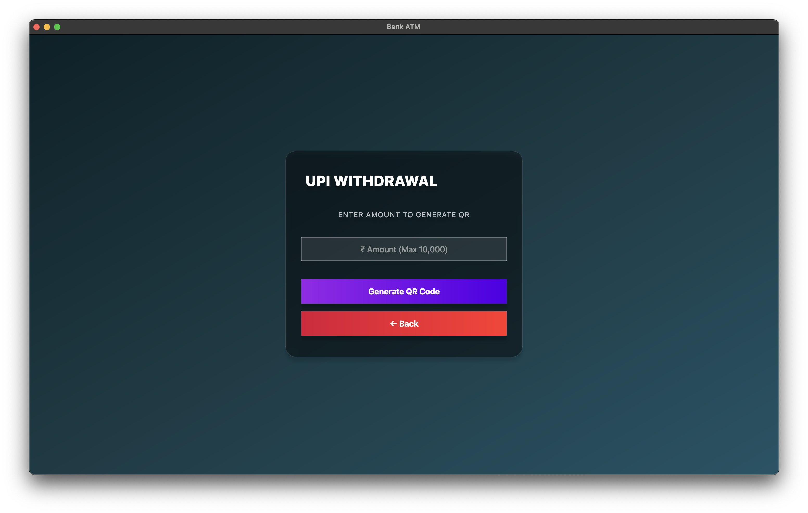
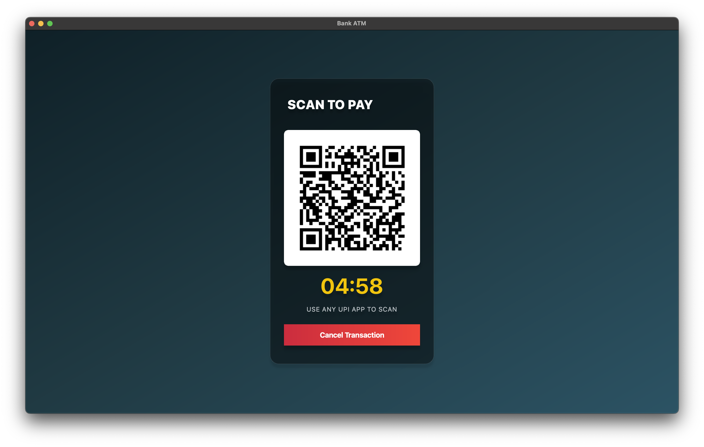
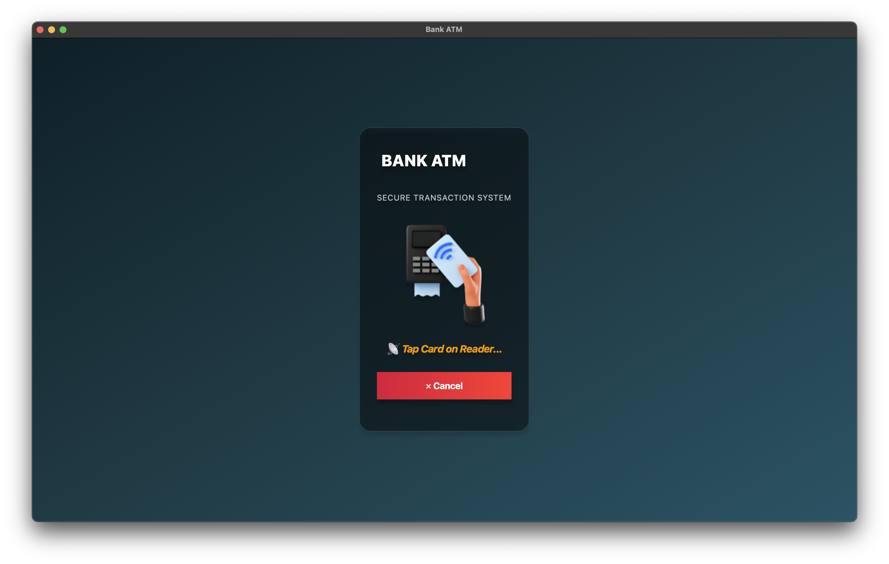

# Next-Gen-ATM
This is a project simulating ATM using OOP concepts in CPP and integrating UPI and NFC for making cash withdrawals more convenient and cardless.

## Features
- UPI Withdrawal (UPI QR genertaion using [nayuki/QR-Code-generator](https://github.com/nayuki/QR-Code-generator))
- Tap & Pay (Using NFC Card and Mobile Phone to read the NFC tag)
- Platform Independent:
  UI made with QT (UI can be rendered on any operating system)

## Local Setup / Installation
### Terminal
- **Linux/MacOS :**
  1. [Download zip](https://github.com/yash-g01/Next-Gen-ATM/archive/refs/heads/main.zip) of this repo.
  2. Extract the downloaded zip file
  3. Open terminal and change directory to the extracted folder.
  4. Go to the terminal folder
     ```bash
     cd terminal
     ```
  5. Run command to compile the cpp code into executable named `atm`
     ```bash
     g++ main.cpp qrcodegen.cpp -o atm
     ```
  6. Run command to execute the compiled code
     ```bash
     ./atm
     ```
     OR Double Click on the executable file named `atm` in the terminal folder.

- **Windows :**
  1. Make sure MinGW/GCC/G++ is installed. If its already installed and setup, follow the linux steps. If not, install `mingw-get-setup.exe` from [here](https://sourceforge.net/projects/mingw/files/Installer/mingw-get-setup.exe/download).
  2. Open the setup file `mingw-get-setup.exe`. Click on `Install` -> Select the Installation Folder (By default: `C:\MinGW`) then click `Continue`.
  3. Right Click on `mingw32-gcc-g++-bin` -> Mark for Installation.
  4. Click on `Installation` on top ribbon -> click on `Apply Changes` -> `Apply`
  5. After the installation from setup wizard, Search for `Edit the system environment variables` and open it -> Click on `Environment Variables`
  6. In `System Variables` section click on `Path` variable -> click `New` -> click `New` on right menu bar -> write path to the MINGW installation then add `\bin`, if you haven't selected any folder in step 2 then type `C:\MinGW\bin` -> Click `OK`.
  7. Now follow the same steps of Linux/MacOS.

Here's a [short video tutorial for MinGW Installation](https://www.youtube.com/watch?v=8CNRX1Bk5sY).

### Qt Application

1. Download [Qt Online Installer](https://www.qt.io/download-qt-installer-oss) for your Operating System.
2. Install Qt Creator using Qt Online Installer.
3. Open the project [`QtApp`](/QTApp) directory in Qt Creator.
4. Click on the Build Icon in Bottom right corner.
5. Click on the Run Icon.

- **On MacOS :** You can also install qt using homebrew:
  ```bash
  brew install qt
  ```
  - Change directory to `QtApp`
    ```bash
    cd QtApp
    ```
  - Build the source code
    ```bash
    qmake ATMSim.pro
    make
    ```
  - Run the app
    1. Open the `QtApp` folder.
    2. You will find a new folder `app`.
    3. Inside `app` folder there will be a `NextGenATM` App. Double Click to run it.
   
## Usage (QT Only)
*Note : Account details are stored as object and created before runtime.* [View Code](https://github.com/yash-g01/Next-Gen-ATM/blob/88ac01a7e7f301bc84f7de15594c29f29e42fffc/QtApp/atm_qt_app.cpp#L228)
1. Menu Page
   - Select Options (Account Number, UPI Withdrawal & NFC)
   
2. Account Login (Enter Account Number on Menu Page then click `Verify Account`)
   - Authentication
   
   - Home Page
   
   - Deposit
   
   - Withdraw
   
*Note : Deposit & Withdrawl Amount should be in multiples of 100.* You can change this behaviour [here](https://github.com/yash-g01/Next-Gen-ATM/blob/88ac01a7e7f301bc84f7de15594c29f29e42fffc/QtApp/atm_qt_app.cpp#L63).
3. UPI Withdrawal
   - Enter Amount to generate QR
   
*Note : Amount should be in multiples of 100.* You can change this behaviour [here](https://github.com/yash-g01/Next-Gen-ATM/blob/4b74cd5727d013b17e457a3d169465ad630f858e/QtApp/atm_qt_app.cpp#L687).
   - Show generated QR
   
*Note : Payment can't be updated since transactions are not being tracked.*
4. NFC
   - NFC Page
   
   
